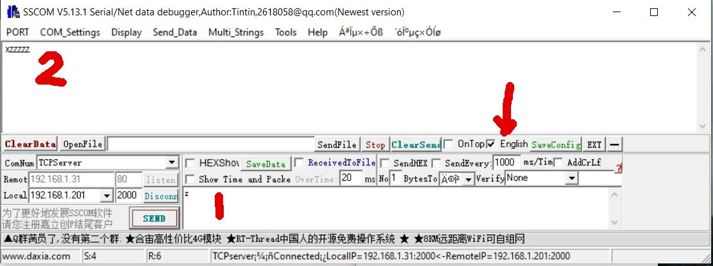

# CH9121 UART to Ethernet

If you've ever struggled with the chinglish instructions and failed to get this workign then this short guide is for you!

## Connection

This is pretty straight forward - connect the UART pins to your device. Note that the power comes from the +5V pin on the breakout board, not the 3V3. Connect the RX of the UART to the TX of the CH9121 and the TX of the UART to the RX of the CH9121

## Software and config

This is actually straight forward when you know how. The instructions are gibberish and look to have been translated from Chinese to English by someone who only speaks Arabic.

You will need at least the "Net Module Config" program to configure the CH9121. Most other instructions also refer to the SSCOM app, but you don't *need* that. There is a very simple TCP Server with this gist. It will suffice for basic testing.

### Net Module configure

Start by powering up the CH9121 and connecting it to you network. It has a default IP address that may not suit everyone. Press the search button and hopefully the device will appear in the listing.

Double clicking the device in the Module List table will load it's current config settings. 

#### Basic

This is the IP address, mask etc of the device itself. Set this to suit your network. On my network but luck, the default settings were fine. 

#### Right hand panel: Port 1

This is where the CH9121 is going to try and send the UART data to. Set the port and IP address of the target in this section along with the UART configuration. 

* Mode: When set as a **TCP Client**, this CH9121 will listed on it's RX pin and transmit the data to the target. I have not tested other settings.

* Local Port: The port your TCP Server is listening on

* Dest IP: The IP of the target server

### SSCOM

If you want to use this then this might help.

First, make sure to tick the **English** box (arrowed). The UI is still mostly either Chinese or gibberish (depends on your language settings), but at least some of the boxes will be labeled ok.

On the lower left, select TCPServer and in the field marked **Local** set the IP and port of the CH9121. Click on the **listen** button. What you type in box 1 is sent to the CH9121 and when you send back should appear in box 2.

Hope this helps.

